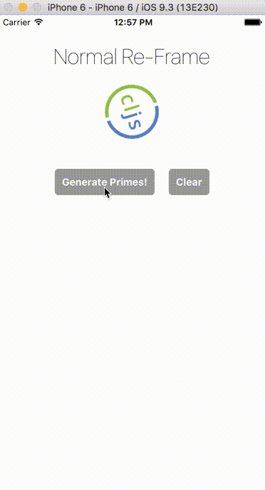
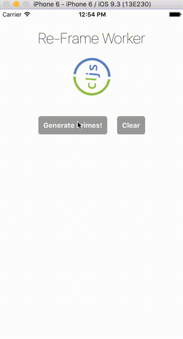

# worker-test

An example showing a spinning clojure logo with a computationally intense operation (generating prime numbers).  The normal re-frame version pauses the animation, but the worker performs it in the background.

## Usage: Normal Re-Frame
* `lein clean`
* `npm install`
* `rnpm link react-native-workers`
* `re-natal use-figwheel`
* `lein figwheel ios`
* `react-native run-ios`

## Usage: Re-Frame Workers
* `lein clean`
* `npm install`
* `rnpm link react-native-workers`
* `lein prod-build`
* `react-native run-ios`

## React Native Packaging Problems
* If you have problems, it's probably RN's Packager.  Try closing any open versions, cleaning it and restarting it
* `rm -rf $TMPDIR/react-* && watchman watch-del-all && npm cache clean`
* `npm start`
* Also keep in mind it's super slow.  It takes forever to find dependencies in development, but in production everything runs very fast.

## License

Copyright © 2016 Sean Tempesta

MIT License

Permission is hereby granted, free of charge, to any person obtaining a copy
of this software and associated documentation files (the "Software"), to deal
in the Software without restriction, including without limitation the rights
to use, copy, modify, merge, publish, distribute, sublicense, and/or sell
copies of the Software, and to permit persons to whom the Software is
furnished to do so, subject to the following conditions:

The above copyright notice and this permission notice shall be included in all
copies or substantial portions of the Software.

THE SOFTWARE IS PROVIDED "AS IS", WITHOUT WARRANTY OF ANY KIND, EXPRESS OR
IMPLIED, INCLUDING BUT NOT LIMITED TO THE WARRANTIES OF MERCHANTABILITY,
FITNESS FOR A PARTICULAR PURPOSE AND NONINFRINGEMENT. IN NO EVENT SHALL THE
AUTHORS OR COPYRIGHT HOLDERS BE LIABLE FOR ANY CLAIM, DAMAGES OR OTHER
LIABILITY, WHETHER IN AN ACTION OF CONTRACT, TORT OR OTHERWISE, ARISING FROM,
OUT OF OR IN CONNECTION WITH THE SOFTWARE OR THE USE OR OTHER DEALINGS IN THE
SOFTWARE.